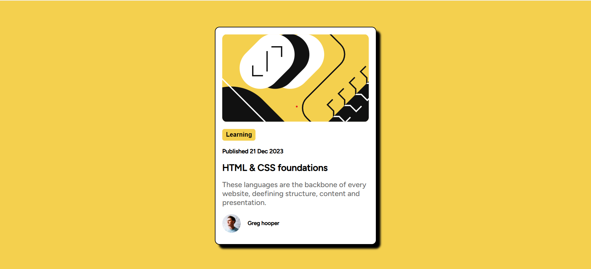

# Frontend Mentor - Blog preview card solution

This is a solution to the [Blog preview card challenge on Frontend Mentor](https://www.frontendmentor.io/challenges/blog-preview-card-ckPaj01IcS). Frontend Mentor challenges help you improve your coding skills by building realistic projects. 

## Table of contents

- [Overview](#overview)
  - [The challenge](#the-challenge)
  - [Screenshot](#screenshot)
  - [Links](#links)
- [My process](#my-process)
  - [Built with](#built-with)
  - [What I learned](#what-i-learned)
  - [Continued development](#continued-development)

## Overview

A responsive Blog preview card done using HTML and CSS. it adjusts perfectly to smaller screen size.

### The challenge

Users should be able to:

- See hover and focus states for all interactive elements on the page

### Screenshot

### Links

- Solution URL: [Add solution URL here](https://zimanie.github.io/blog-preview-card/)
- Live Site URL: [Add live site URL here](https://your-live-site-url.com)

## My process

### Built with

- Semantic HTML5 markup
- CSS custom properties
- Flexbox
- Mobile-first workflow

### What I learned

I learnt how to use media query to create a responsive layout for both desktop ad mobile. i learnt how to use dev tools to see any screensize i want and work with it.

### Continued development

i would like to continue on this path and get better with it.

## Author

- Frontend Mentor - [@Zimanie](https://www.frontendmentor.io/profile/Zimanie)
- Twitter - [@yZimanie5e](https://www.twitter.com/Zimanie5)

